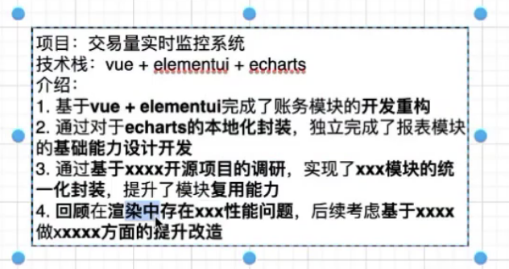

# 社招复习指南

1. 技术专项（动画、兼容性、性能优化、性能监控），（动画、兼容性、前端脚手架、性能优化、node、监控平台、数据埋点、微前端、构建工具打包优化、ci/cd）
2. 项目经历（最好可以结合技术专项）
3. 八股文（https非常重要，浏览器输入url需要找一个单项来说，也非常重要）
4. 算法题(手写编码题(如果不是一线大厂的话，优先这个) > leetcode hot100（字节必须）)

# 怎么写好简历
 https://gugiegie.gitee.io/frontend/frontend/preface/resume.html

专业技能
- 熟悉react/next.js开发，阅读并且理解其源码，能够承担从0～1搭建react技术栈项⽬；
- 熟悉常用构建工具如：webpack/vite，阅读并且理解其编译主流程，具备写插件解决问题的能力；
- 熟悉浏览器缓存，对浏览器端的缓存有全⾯深刻的研究，并且实现过独⽴的缓存解决⽅案；
- 深入了解和实践复杂玩法动画、移动端兼容性、性能优化、国际化与多语言；

# 项目描述
移动端，低代码，微前端，监控，性能优化，项目模板，ci/cd

不是描述项目，而是描述你自己



## 语音业务移动端项目
项目描述: 负责语音业务线，app内嵌webview、玩法交互类h5的开发与维护；在整个生命周期内，负责过旧项目的迁移工作、新h5、pc项目的架构设计，统一h5的模板，并深入研究与实践多语言、性能优化、兼容性、小游戏活动、复杂的动效 ；

技术栈: next.js + axios + zustand + i18next + pnpm + typescript

项目亮点：
- 项目模板（ci/cd, 多语言，bridge）具备最小mvp功能，研发规范，具备快速复制的功能；
- DDD实践（Domain-Driven Design）：领域驱动设计（不使用 graphql、内聚，计算，不不同的ui展示，比如钱包页面）；
  1. 业务逻辑和数据处理放在service层（UI与数据分离，数据与数据处理、业务逻辑分离）
- 多语言的实践
  1. css背景图多语言(html lang 标签选择器, 需设置lang属性，mixin)，js动态引入图片（webpack.require）
  2. （重点和亮点，详细说）语言包管理（自动拉取excel；i18n Ally => zh.json => 借助自动翻译工具 => excel => 回写到google excel， 画个流程图https://bobi.ink/2023/08/08/i18n-locale/）; https://juejin.cn/post/7174082242426175525, 自动提取“中文”，加t函数(参考bundle/babel)
  3. 语言包根据业务动态加载（1. 首先ssg的时候已经打包不同语言的url路径（使用getStaticPaths方法,locale参数）；2. 根据模块，加载翻译；next.js的ssg下，使用nexti18的serverSideTranslations;）

- 解决构建产物的兼容性问题，降低线上兼容性故障发生概率（es-check问题，解决兼容性和白屏问题）; 参考bundle/babel目录，总结：https://borninsummer.com/files/2018/11/acorn.js-intro.pdf，ACORN.js的原理和应用
- pnpm解析第三方包的问题，由此引入webpack的寻址原理(enhanced-resolve)，软链，硬链，优缺点（参考monorepo.md）
- 弹窗管理 https://github.com/ebay/nice-modal-react

  优势
  - 调用过程干净优雅
  - 组件依旧存在于上下文中（可以自定义位置，默认在 Provider 下）
  - show/hide 方法返回值为 Promise，方便链式调用（通过useModal().resolve(val)等方法改变 Promise 状态）

  实现
  - 1. 弹窗调用方式问题，维护弹窗状态过多 —— NiceModal.Provider 内统一渲染弹窗
  - 2. 显隐相关状态以及方法需要共享 —— 库内部维护对应状态，通过统一 API （show/hide/useModal）暴露
  - show/hide/useModal 等方法就是基于 dispatch 函数进行弹窗数据（Context） 的更新从而触发视图更新（其中 show 方法多一步注册，生成 ID 并绑定至对应的高阶组件）
  ```js
  const Provider: React.FC = ({ children }) => {
    // 初始弹窗信息
    const [modals, _dispatch] = useReducer(reducer, initialState);
    dispatch = _dispatch;
    return (
      <NiceModalContext.Provider value={modals}>
        {children}
        <NiceModalPlaceholder />
      </NiceModalContext.Provider>
    );
  };

  const NiceModalPlaceholder: React.FC = () => {
    const modals = useContext(NiceModalContext);
    // 根据弹窗信息找到需要渲染的弹窗 ID （NiceModal.show 时更新）
    const visibleModalIds = Object.keys(modals).filter((id) =>
      Boolean(modals[id])
    );

    // 找到对应创建的高阶组件(NiceModal.show 时注册）
    const toRender = visibleModalIds
      .filter((id) => MODAL_REGISTRY[id])
      .map((id) => ({
        id,
        ...MODAL_REGISTRY[id],
      }));

    return (
      <>
        {toRender.map((t) => (
          {/* 渲染 NiceModal.create 创建的高阶组件，并注入 ID */}
          <t.comp key={t.id} id={t.id} />
        ))}
      </>
    );
  };

  const create =
    <P extends Record<string, unknown>>(
      Comp: React.ComponentType<P>
    ): React.FC<P & NiceModalHocProps> =>
    ({ id }) => {
      const modals = useContext(NiceModalContext);
      const shouldMount = Boolean(modals[id]);

      if (!shouldMount) {
        return null;
      }
      return (
        <NiceModalIdContext.Provider value={id}>
          {/* 找到对应 ID 的参数，传入内部真实组件 */}
          <Comp {...(modals[id].args as P)} />
        </NiceModalIdContext.Provider>
      );
    };
  ```

- next.js打包优化（重要），部署`standalone`模式打包
- next.js采用 link做预加载（让客户端预先加载一个webview）, 参考性能优化.md（作为亮点，hhh）
- 多app马甲包的bridge抽象；（设计上的优势，控制反转，bridge通信原理，每一种的具体情况）;
- 参考 动画专题.md;
- https://mp.weixin.qq.com/s/23ZFPK4CaCkinwpZ3SG9Rw , 性能检测，异常上报，


## 活动模板低代码平台
项目描述：了解低代码，知晓平台架构理论，参与过低代码的开发

* zustand的深入应用可以说说:https://juejin.cn/post/7213189189303353403#heading-10

技术栈： React + zustand + immer.js + pnpm + moneropo + typescript

- 物料库设计与实现（重点是数据结构）
- 套打编辑器设计与实现
- formily表单通过配置，自动化渲染
- 元组件、布局组件（双列布局组件）

## 文档平台设计与实现
nestjs实践内容，nest实践内容

## 监控（性能、异常）系统, 性能监控、异常监控
1. sentry为主

## 登录sdk的设计与开发

1. 统一登陆SDK（h5端）

  解决痛点：
  多个部门的活动页，常规业务，都需要用到h5登陆

  钩子函数：
   1. commonLogin()
   2. getToken()
   3. reflushToken()

  技术点：
  1. 解决跨域问题()（跳至中转页面（获取code））(增加了一次跳转，解决多个不同域名使用同一微信号的授权问题)
  2. 解决token过期问题，reflush token
  3. cookies存oppenid，不用一直与微信服务器交互
  4. 验证redirectUrl的域名（创建域名白名单）
  5. 双token续登机制
  6. 原页面带了很多参数，授权回来后你怎么处理呢（放在redirect_uri, state有长度限制）（使用 Cookie：将额外的参数存储在 Cookie 中。在用户授权成功后重定向到 redirect_uri 页面时，你可以在页面中读取 Cookie 中的参数，并进行相应的处理。请注意，Cookie 有大小限制，如果参数较多或过大，可能会受到限制），服务端：使用会话（Session）或缓存；
  7. 能不能实现单点登陆
  8. 每次不同域名还得重新去走授权（用一个iframe做一个第三方鉴权平台）, 相同域名用共享cookie
 安全问题：
  9. auth2.0 code的作用
  10. 对redirect_uri进行检查禁止特殊字符输入
  11. code参数（有效性、获取token，避免暴漏）可用于防止csrf攻击（跨站请求伪造攻击）

发npm包，可以把npm，yarn, pnpm，文档构建啥的都说一遍

发包规范：
1. standard-version、release-it 控制版本
2. peer-dependences 控制宿主环境
3. tag作为构建依据，方便回滚

https://q.shanyue.tech/train/interview

面试必要准备：

表述清晰的简历：

1. 真实陈述，勿造假
2. 避免关键词堆砌，空洞

基本功：
别背概念，重要的是应用

项目经历：
1. 重点是个人产生的影响
2. 突出成长性，结构化思维

职业规划：
1. 目前的长短板（深入方面，小程序，flutter）
2. 后续的职业成长方向

# 需要突出自己优势的地方：为了证明是你的项目，你得有具体的内容作为支撑

1. 多语言，多语言工具bbt npm包管理工具（重点）
2. ci/cd通用流程库（遇到的rollup打包问题、总结的发包问题、pnpm问题）（重点）
3. nest.js，服务端渲染，项目工程化（这个方面，check，图片优化，动画，异常处理）（重点）
4. 弹窗管理，详解
5. lowcde 
6. 文档平台的使用(设计与使用)
7. 动画专题（重点）活动跟复杂动效

