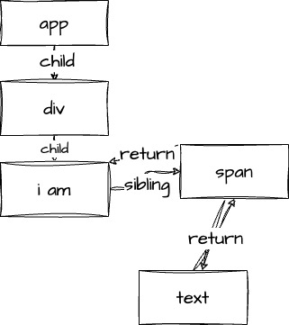

## react课程
https://vue3js.cn/interview/vue/vue.html

- react: 单向数据流, UI = render(data)
 - vue： MVVM，双向数据绑定

## JSX介绍
- JS extend 把UI和逻辑耦合起来
- jsx渲染dom; ReactDOM.render => **虚拟dom生成真实dom**，挂载到html节点
- React.createElement(type（节点类型）, config (节点的属性), children（子元素）)（React.createElement的嵌套关系生成html节点树形结构）  => **生成虚拟dom**

`React.createElement`实现（表达组件内的数据结构，不包含scheduler、reconciler、renderer）
  ```js
    function createElement (type, props, ...children) {
      // 核心就是把参数都放到一个对象返回
      return {
        type,
        props: {
          ....props,
          children,
        }
      }
    }
  ```

`ReactDOM.render()`实现

  ```js
  
  ```

### react如何防 xss
- 反射型
  demo: 把用户输入的数据 “反射” 给浏览

- 存储型
  存储到数据库

jsx: 特殊字符转译，for循环，charCodeAt取每一个字符，去转译
## hoc
> 高阶组件是参数为组件，返回值为新组件的函数

- 属性代理；组合角度出发，外部操作wrapcomponent，通过props、或者在组件外加拦截器
```js
// 属性代理的高阶组件
const withLogger = (WrappedComponent) => {
  return class extends React.Component {
    componentDidMount() {
      console.log("Component has been mounted");
    }

    render() {
      // 将额外的属性传递给原始组件
      return <WrappedComponent {...this.props} />;
    }
  };
};

// 原始组件
const MyComponent = (props) => {
  return <div>{props.message}</div>;
};

// 使用高阶组件增强原始组件
const EnhancedComponent = withLogger(MyComponent);

// 使用增强后的组件
ReactDOM.render(<EnhancedComponent message="Hello, World!" />, document.getElementById("root"));
```
- 反向继承；继承角度出发，内部操作wrapcomponent, 在原始组件增加新的功能

```js
// 反向继承的高阶组件
const withToggle = (WrappedComponent) => {
  return class extends WrappedComponent {
    constructor(props) {
      super(props);
      this.state = {
        toggle: false,
      };
    }

    toggle = () => {
      this.setState((prevState) => ({
        toggle: !prevState.toggle,
      }));
    };

    render() {
      // 在原始组件的基础上增加新的功能
      return (
        <div>
          <button onClick={this.toggle}>Toggle</button>
          {super.render()}
        </div>
      );
    }
  };
};

// 原始组件
class MyComponent extends React.Component {
  render() {
    return <div>{this.state.toggle ? "Toggled On" : "Toggled Off"}</div>;
  }
}

// 使用高阶组件增强原始组件
const EnhancedComponent = withToggle(MyComponent);

// 使用增强后的组件
ReactDOM.render(<EnhancedComponent />, document.getElementById("root"));
```

## hooks思想
Hooks 带有强烈的 3 个特点：primitive 、decentralization 、algebraic effects 。

* primitive 。元数据化，从最底层构建，让数据结构更清晰。同时也是一种工程趋势，比如 Tailwind CSS 便是将 CSS 元数据化。
* decentralization 。去中心化，class 时代普遍是一种 "顶层下发" 的理念，但 Hooks 带来强烈的 "组件自治" 的理念（比如 Provider 不再必须，组件请求自行处理）。同时，在其他领域，去中心化也是一个大的流行概念。
* algebraic effects 。代数效应，归根结底，Hooks 可以理解为一根管道，直通 React 核心能力，将内部机器暴露给了开发者。

## 为什么需要react hooks

* 告别难以理解的 Class；this，生命周期(特别是生命周期，经常忘记)
* 解决业务逻辑难以拆分的问题；学习复杂的render prop， hoc等，换取灵活度, 代码复杂度高
* 使状态逻辑复用变得简单可行；
* 函数组件从设计思想上来看，更加契合 React 的理念。框架的设计理念；UI = render(data); 函数式编程

## useRef使用场景

- 访问dom元素
- forwardRef, useImperativeHandle, 向上暴露ref（句柄）
- ref 作为数据存储时内容的变化不会引起 re-render

## 获取 context
- useContext
- Context.comsumer

## useReducer 
入参：
  1. 函数，包含state、action，返回值根据action不同而改变state
  2. state初始值

出参：
  1. 更新后的state
  2. dispatch函数，派发更新的函数, 会导致组件重新渲染（re-render,另一个是useState））

## useCallback useMemo

* useMemo 缓存值
```js
import { useRef, useEffect } from 'react';

function useMemo(computeFunc, dependencies) {
  const ref = useRef();

  if (!ref.current) {
    ref.current = {
      dependencies,
      value: computeFunc(),
    };
  }

  if (
    dependencies.some((dependency, index) => dependency !== ref.current.dependencies[index])
  ) {
    ref.current = {
      dependencies,
      value: computeFunc(),
    };
  }

  useEffect(() => {
    ref.current.dependencies = dependencies;
  });

  return ref.current.value;
}

export default useMemo;
```
* useCallback 缓存函数；少用（依赖项，很难定义，作为props传递的函数，集合memo一起使用；）
* useCallback真正的作用是在函数需要作为prop传递给子组件时，使用useCallback包裹可以避免子组件无谓的更新
* 回调函数依赖的依赖项（dependencies）频繁变化，会导致子组件频繁重新渲染，从而引起性能问题
* 过度使用导致代码复杂性增加；


```
import {useRef, useEffect} from 'react'

function useMemo(componentFunc, deps) {
	const ref = useRef()

}
```
## useMemo, React.memo
- React需要自己做性能调优
- React.memo 会比较新旧 props(浅比较), 确定是否要重新渲染组件，re-render
- useMemo则是缓存计算结果；多用

## useEffect、useLayoutEffect、useInsertionEffect

* useEffect: **组件更新挂载完成 => dom绘制完成 => useEffect回调**；异步调用; 浏览器绘制视图之后，适合副作用（存在react调和的commit阶段）（useeffect 无法直接使用 async await, useEffect的回调函数必须返回一个清理函数或者undefined） 
* useLayoutEffect: **组件更新挂载完成 => useLayoutEffect回调 => dom绘制**; 同步调用；DOM 更新之后，浏览器绘制之前，浏览器只会绘制一次（适合更新dom，解决闪屏问题）（存在react调和的commit阶段）
* useInsertionEffect（18）：DOM 还没有更新。本质上 useInsertionEffect 主要是解决 CSS-in-JS 在渲染中注入样式的性能问题
 
## react hooks使用限制；
1. 底层链表结构，不能在判断或者条件语句使用（没有记录每个hooks的状态信息，**初始化顺序和更新的时候顺序是一致的**（若遇到条件语句会不一致），更新取值的时候就会报错）
2. 需在react自身的环境中使用，底层依赖三个方法：HooksDispatcherOnMount, HooksDispatcherOnUpdate, ContextOnlyDispatcher(React context和 useReducer)

## hoc与hooks
- hooks函数式编程；取代生命周期中的内容
- hoc更加高内聚，通过props，属性，实现更多功能扩展  

## react如何实现 异步组件
- React.lazy() , React.suspense
- import() 动态引入

## react性能优化
https://juejin.cn/post/6844903865926549511

1. 避免重新渲染, 减少render（缓存）
 - React.memo props浅比较, useMemo; 减少render
 - 变化的props/states属性和不变的属性进行分离，减少了重新渲染（动静分离，将变的部分与不变的部分分离，组件层面）
 ```js
  function EventRc () {
      const setState = useSetRecoilState() // recoil
      
      useEffect(() => eventBus.addEventListener('something-changed', (event) => {
          setState(event.detail)
      }), [])
      
      return <></>
  }

  function Foo () {
      return (
          <div>
              <Apple />
              <Boy />
              <Cat />
              <EventRc />
          </div>
      )
  }

 ```
 - 惰性组件, 经典的tab，激活才加载pannel
 - 不可变数据，Immutable.js、Immer
2. 组件层面（动静分离，将变的部分与不变的部分分离。）
 - 懒加载，使用React.lazy和Suspense进行组件的懒加载(比如在用next.js的时候，apng动图时，打包一个placeholder占位超级大，Reac.lazy()/import懒加载没这个问题)
 - 异步组件 import,React.lazy()

3. 框架机制层面
 - ssr

## React架构
https://bobi.ink/2019/10/18/react-fiber/
react 15
 - reconciler 协调器, 找出要变化的组件
  1. this.setState()
  2. this.forceUpdate()
  3. ReactDOM.render()
 
 - renderer, 渲染器，将要变化的组件渲染到页面

 react 15缺点
 1. Stack Reconciler 是一个同步的递归过程(递归更新子组件)，层级很深
 2. 不支持同步任务拆分为可中断的更新

react16
 - scheduler 调度器，调度任务优先级，高优先级进入reconciler
 - reconciler 协调器
 - renderer 渲染器

scheduler机制: 
1. 当浏览器有空余时间，告诉我们去执行任务；
2. lane，提供多种任务调度优先级的设置

requestIdleCallback
1. 浏览器兼容性不行
2. 切换tab，不同浏览器的触发事件频率不一样

示例：
```js
// 由
<ul>
  <li>1</li>
  <li>2</li>
  <li>3</li>
</ul>

// 更新为
<ul>
  <li>2</li>
  <li>4</li>
  <li>6</li>
</ul>
```

react 15: 同步更新，不可中断, reconciler、renderer交替执行
react 16:
 - scheduler; 
  1. 接受请求变化，当前有没有优先级更高的任务
  2. 当前帧有没有剩余时间（shouldYield 函数判断）
 - reconciler; （可中断的异步递归dfs）
  1. 接受变化
  2. 1 - 2，2-4，3-6
  3. 给三个li都加上需要更新的tag、update
 - renderer; effectList （同步的）

1. render

fiber节点创建并构造render树；
 - 1 beginWork; 递
 - 2 rootFiber 深度优先遍历，为遍历的所有fiber节点调用 beginWork，遍历结束后进入completeWork
 - 3 completeWork; 归

 ```js
  function App() {
    return (
      <div>
        i am
        <span>text</span>
      </div>
    )
  }

  ReactDOM.render(App, document.getElementById('root'))
 ```
 

 beginWork
 
 构造fiber节点
 ```js
  function beginWork(
    current: Fiber | null, // 上一次 更新的fiber节点 
    workInProgress: Fiber, 
    renderLanes: Lanes,
    ) {
      // ...
      reconcileChildren() // 构造fiber节点，分update和mount情况
    }
  // current = workInProgress.alternate
 ```

completeWork

将effectTag的fiber挂载在父级的fiber的effectList末尾
维护一个单向链表
```js
v  function completeWork(
    current: Fiber | null, // 上一次 更新的fiber节点 
    workInProgress: Fiber, 
    renderLanes: Lanes,
    ) {
      // ...
      workInProgress.tag
    }
```

2. commit

- before mutation; 用户行为操作初始化，dom节点渲染，useEffect
- mutation; 更新中
- layout ; dom执行后，先遍历effectList, 去调用一些更新后的生命周期或者执行事件的处理，如：componentWillUnMount, componentDidMount

### react diff
1. 不同类型，新建
2. 相同类型的单一元素；DOM保留，更新props
```js
<div className="class1"></div>
<div className="class2"></div>
```
3. 相同类型的组件元素；可以用key（要求稳定，唯一）优化
```js
  <ul>
    <li>1</li>
  <ul/>
    <li>1</li>
    <li>2</li>
  <ul/>
```

为什么react diff不能使用双指针？
vue: array
react: effectList(单链表)

diff本身限制：
1. 同层比较
2. 不同类型，直接重建
3. 使用key，方便比较

### lane 优先级
1. 0 1 表示优先级
2. 位数越低，优先级越高
3. 同一个优先级，可以有多个位置: **批**；（越低优先级的更新越容易被打断，导致积压下来，所以需要更多的位。相反，最高优的同步更新的SyncLane不需要多余的lanes）
4. 通过位运算符比较，方便进行优先级相关计算


## fiber架构
功能方面：
1. 支持不同的优先级
2. 可恢复、可中断
3. 恢复后能回到之前执行的状态

数据结构方面：
1. react 16前，reconciler是通过递归执行，数据是存储在递归调用栈
2. react 16, fiber reconciler
 - 每个fiber都用来标识对应一个React Element, effect update delete


### react16，react 15，reconcile


**react组件的更新流程**

能简单介绍一下 react 执行过程吗

* jsx 经过 babel 转变成 render 函数
* create 
* update 
* enqueueUpdate
* scheduleWork 更新 expiration time
* requestWork
* workLoop大循环
  - performUnitOfWork
  - beginWork
  - completeUnitOfWork
* Effect List
* commit


1. 输入: 将每一次更新(如: 新增, 删除, 修改节点之后)视为一次更新需求(目的是要更新DOM节点).
2. 注册调度任务: `react-reconciler`(构造器)收到更新需求之后, 并不会立即构造fiber树, 而是去调度中心scheduler注册一个新任务task, 即把更新需求转换成一个task.
3. 执行调度任务(输出): 调度中心scheduler通过任务调度循环来执行task(task的执行过程又回到了react-reconciler包中).
    - fiber构造循环是task的实现环节之一, 循环完成之后会构造出最新的 fiber 树.
    - commitRoot是task的实现环节之二, 把最新的 fiber 树最终渲染到页面上, task完成.
    - 主干逻辑就是输入到输出这一条链路, 为了更好的性能(如批量更新, 可中断渲染等功能), react在输入到输出的链路上做了很多优化策略, 比如本文讲述的任务调度循环和fiber构造循环相互配合就可以实现可中断渲染

**为什么要引用fiber（react15的缺点）**
-  JavaScript 线程和渲染线程必须是互斥的
-  react15中， Stack Reconciler 是一个同步的递归过程(递归更新子组件)。Stack Reconciler 需要的调和时间会很长，这就意味着 JavaScript 线程将长时间地霸占主线程，进而导致我们上文中所描述的渲染卡顿/卡死、交互长时间无响应等问题。
- 不支持将同步任务，拆分成可中断的异步更新；

**fiber工作机制(更多的是一种更新机制)**
1. 相对于数据结构；每个fiber对应⼀个组件，保存了这个组件的类型对应的dom节点信 息，这个时候，fiber节点就是我们所说的虚拟DOM；fiber 结构保存了，tag、type、key、effecttag、memoState、props等信息，然后在调和的过程进行比较新旧 Fiber 树的差异，两棵fiber 树是一个更新交替的过程；
- mount: reconciler根据JSX的内容生产对应的fiber节点
- update：reconciler先将更新后的JSX产生fiber, 比较新旧 Fiber 树的差异 , 打上tag, effect


**fiber具体解决什么问题：**
1. react的更新自上而下，把更新的问题交给浏览器处理（卡死，响应慢），于是有了16版本之后的react fiber；vue有模版语法，实现静态编译、vue基于数据劫持，更新粒度是组件级别的
2. 支持快速响应，将同步的长尾任务转换为可中断的更新 

**fiber为什么能让动画变流畅流畅**
1. requestAnimationFrame优化性能，
2. 在同样的帧率下，减少每一帧的渲染时间（时间切片）；每一帧中只处理少量工作（requestIdleCallback, 浏览器空闲时间执行），所以可以在同样的时间内完成更多的帧渲染，**规定时间内获得更多的动画帧**；

**fiber reconcilation（协调）做了什么事情**（处理组件更新的过程）
1. 找出两棵 react element tree 的差异；
2. 将差异更新到真实 DOM，从而完成 UI 的更新；

> reconciliation算法通过将前后两个React element tree进行比较，确定哪些元素需要更新、哪些需要新增、哪些需要删除，将差异更新到dom，完成UI更新; 在这个过程中，reconcile是一个重要的步骤，它会比较两个React元素，并决定它们是否相同

* diff（差异计算）阶段；React Fiber 会比较新旧 Fiber 树的差异；React Fiber 使用一种称为“双缓存技术”的优化策略（能够帮我们较大限度地实现 Fiber 节点的复用），即在内存中创建两个 Fiber 树：current tree 和 workInProgress tree。current tree 表示当前正在渲染的 Fiber 树，workInProgress tree 则表示正在进行更新的新 Fiber 树。在 Diffing 阶段，React Fiber 会将 current tree 和 workInProgress tree 进行比较，并为有变化的节点打上 effectTag 标记（添加到 effect list 链表中）。

* render阶段， Reconciliation 会从 fiber node tree 最顶端的节点开始，重新对整棵 fiber node tree 进行 深度优先遍历，遍历树中的每一个 fiber node，处理 fiber node 中存储的 work。遍历一次 fiber node tree 的执行其中的 work，这个过程被称作一次 work loop；fiber node自己和子节点处理完，算完成，接着处理兄弟节点

* committing 阶段的过程是将有变化的节点的 effectTag（使用effect list中记录的操作来更新 DOM） 标记转化为具体的 DOM 操作，并将这些操作提交到浏览器中执行；

- reconcile 负责 vdom 转 fiber（vdom 只有 children 属性来链接父子节点，但是转为 fiber 结构之后就有了 child、sibling、return 属性来关联父子、兄弟节点），并且还会准备好要用的 dom 节点、确定好是增、删、还是改，通过 schdule 的调度，最终把整个 vdom 树转成了 fiber 链表
- 时间切片（任务调度，长任务分成小任务）；（超长的 Task 显然会挤占渲染线程的工作时间）
React 会根据浏览器的帧率，计算出时间切片的大小，并结合当前时间计算出每一个切片的到期时间。在 work Loop 中，while 循环每次执行前，会调用 shouldYield 函数来询问当前时间切片是否到期，若已到期，则结束循环、出让主线程的控制权。
- schedule任务调度（时间切片，长任务分成子任务） 通过requestIdleCallback在浏览器空闲时间执行，每个 fiber 节点的 reconcile（vdom 转 fiber），全部 reconcile 完了就执行 commit；


**fiber中 中断、暂停、恢复怎么做到的？**

中断：requestIdleCallback的回调函数（在浏览器空闲时执行中断逻辑）
暂停：React fiber有状态
恢复：当浏览器下次空闲时，React Fiber 的 requestIdleCallback 回调函数会触发，React Fiber 可以从中断处继续执行任务

1. React Fiber 会将该任务的优先级调整为低优先级
2. fiber为链表，节点保存了大量状态的信息
* Fiber（链表结构） 节点是一个可中断的单元，可以保存执行过程中的状态，并根据需要进行暂停或恢复
* alternate；旧的节点保存在 alternate 字段中；
* React 可以根据 effect list中的 effectTag 的值（create、update 和 destroy）来判断应该执行哪些操作
* React 会将新的状态和属性保存在这些（memoizedState 和 memoizedProps）字段中，并在需要恢复执行时，从这些字段中读取数据。


## react事件机制

1. 在document处监听了所有的事件，当事件冒泡到document处时，交由处理函数统一处理
2. 冒泡到docment的不是原生事件，react自己实现的合成事件
3. JSX 上写的事件并没有绑定在对应的真实 DOM 上，而是通过事件代理的方式，将所有的事件都统一绑定在了 document 上
4. 合成事件：抹平浏览器之间的兼容问题，React 的合成事件采用事件委托的方式处理，这意味着 React 只需要在文档的最外层元素上注册事件处理程序，而不是在每个子元素上注册。这种优化可以减少内存占用和 DOM 操作，提高性能。

## 状态管理

### react-redux机制
* 单向数据流，维护一个全局store
* 获取数据，更新数据逻辑，把这些逻辑抽成高阶组件，用它来连接（connect）组件和 store。通过props的方式来把数据注入到组件中（mapStateToProps，mapDispatchToProps）
* 中间件机制；拦截组件发送给 store 的 action 来执行一系列异步逻辑；
compose（组合函数，类似管道），类似洋葱模型（先请求，后响应，先处理 next(将控制权转移)前的逻辑，每个都有维护Context）

### context机制
> React.createContext 的 api 会返回 Provider 和 Consumer，分别用于提供 state 和取 state，而且也是通过props来透明的传入目标组件的。（这里的 Consumer 也可以换成 useContext 的 api，作用一样，class 组件用 Provider，function 组件用 useContext）

与react-redux区别是 context 没有执行异步逻辑的中间件

注意：其实 react 内部做了处理，如果改变了 context 的值，那么会遍历所有的子组件，找到用到 context 值的组件，触发它的更新。

所以，props、state、context 都能够触发重新渲染。

### state机制
 state 是组件内部的，怎么通过 state 来做全局状态共享呢？

每个组件创建的 state 都指向同一个对象，也能做到全局状态的共享。
但这里有个前提，就是只能修改对象的属性，而不能修改对象本身

* zustand(https://juejin.cn/post/7213189189303353403#heading-10)
* hox
* redux（纯函数）