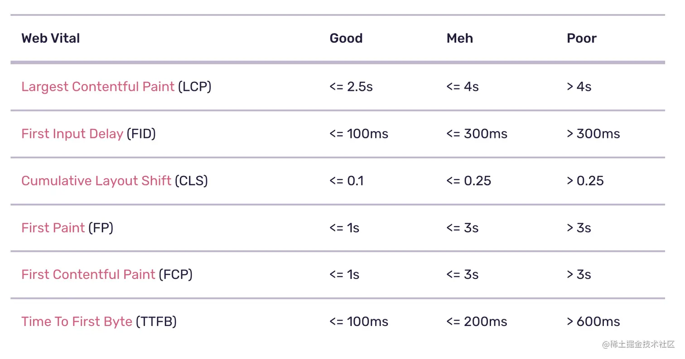

# 性能优化
场景：嵌入app内使用的Hybrid

基于RAIL模型分析性能

- 方法论：https://juejin.cn/post/7274991134362681383
- 回答思路：https://juejin.cn/post/7249665163242307640
- 然后再把优化项：说出哪些优先级高：https://juejin.cn/post/7267436042507911179

你在什么场景下，遇到了什么性能问题，围绕什么样的性能指标，采取了哪些性能优化手段，最后取得了什么样的结果？

# 1. 现有场景，指标统计，遇到的性能问题
* 嵌入app内使用的Hybrid
现象：页面打开慢，白屏时间长（spa），seo不友好；

# 2. 围绕的性能指标
收集工具：接入sentrySDK做性能数据的收集

  参考一下，web vital的标准
  
 - FP
 - FCP
 - LCP
 - FID

- P50，代表中位数的情况，FCP: 1,4s -> 0.9s, LCP: 2s => 1.3s 
- P95，代表弱网情况, FCP: 4.5s => 3.4s
- poor,很差
- pageload

# 3. 具体优化手段

## 根据整个页面加载链路确定优化方案
技术方面：

 - 页面加载链路进行方案拆解，得到容器启动、资源加载、代码执行、数据获取、绘制渲染各个环节

整个需求流程：

 - 优化目标：了解优化目标，即前端首屏加载速度
 - 需求价值：关注需求收益，从技术指标（FMP、TTI）和业务指标（跳失率、DAU、LT）进行分析
 - 实施：制定具体的优化策略和行动计划
 - 成果：评估优化方案的成本和效益。考虑时间、资源和预期收益，确保优化方案的可行性和可持续性。

## 端能力优化策略
 - 容器启动（容器预建）
   - 首次 Webview 初始化（数百ms），还需要初始化浏览器内核、再初始化webview。
   - 优化方法：在客户端刚启动时，就初始化一个全局的WebView待用，并隐藏；（考虑内存状态，做好内存管理，避免内存泄漏）
   - 创建时机：闲时创建。Webview 只能在主线程创建，但又不能阻碍主流程，因此需要在 IdleHandler 时机处理。与前端的 requestIdleCallback 、React Scheduler 概念相似。
   - 创建个数：一般仅创建一个，当预创建的 Webview 容器被使用后，再重新预创建（考虑内存状态）。
 - 资源加载
   - 网络建联优化
      - dns-prefetch
   - 资源离线化
   - 资源分级下发
   - 资源预加载
      - prefetch
 - 代码执行
 - 数据获取
    - 数据预取(简单的实现方案：新建立一个webview，加载data-prefetch页面，获取数据后，销毁webview，存在localStorage中)
    - 数据缓存localStorage
 - 绘制渲染
    - 预渲染

### 容器预建
- 创建时机：闲时创建。Webview 只能在主线程创建，但又不能阻碍主流程，因此需要在 IdleHandler 时机处理。与前端的 requestIdleCallback 、React Scheduler 概念相似。
- 创建个数：一般仅创建一个，当预创建的 Webview 容器被使用后，再重新预创建（考虑内存状态）

### 加载时间（静态资源优化）
 - 打包优化；
    - 页面组件拆分，优先渲染首屏内容；
    - （可以重点说）webpack打包优化；1. framework(react, react-router)  2. commons（引用5次以上） 3. lib
    - 组件、路由按需加载（tab,content）动态import,webpackChunkName
    - 语言包优化
 - 非关键js、css延迟加载；defer、async，浏览器空闲时加载js,css(prefetch)
 - (重要)资源加载优化；图片，webp;(判断方法，分两种，ios 版本>14, android canvas)（可以重点说，加上data-webp，webp的优势：体积小）
 - 字体，生成精简的字体包

### 页面渲染优化
  - ssr, 缩短TTFB（Time To First Byte）优化
  - ssg，预渲染；（终点说说，做了什么优化，包括多语言的优化，语言包的加载（根据业务模块动态加载语言包））
  - 减少重排（回流，跳过了生成布局树和建图层树的阶段，会重新渲染 DOM 树）、重绘操作(可以讲讲浏览器相关，包括动画优化)；GPU加速（跳过布局和绘制流程，利用合成线程处理（不会占用主线程）,transform、opacity）

### react代码层面
 - 避免重新渲染, 减少render
 - React.memo props浅比较, useMemo; 减少render
 - 惰性组件, 经典的tab，激活才加载pannel
 - 不可变数据，Immutable.js、Immer
- 工程层面
 - 懒加载，使用React.lazy和Suspense进行组件的懒加载
 - 异步组件 import,React.lazy()

## 网络优化
 - 静态资源cdn
  - cdn回源、预热
  - 如何判断当前资源是否使用了cdn(header via, server)
  - 配置怎么样的缓存策略？html协商缓存 max-age = 0, 其它的直接强缓存 max-age = 一年（协商缓存，默认开启的）
 - http2
 - dns-prefetch（DNS 预解析技术）

## 弱网优化
  首屏时间从2.5s减少到1.5s（p95, 优化比较明显，4.s => 3.s）

  - 合并请求；弱网一个请求都需要2、3s, 10个请求合并到5个请求
  - 图片; 针对移动端图片，只加载占位图（window.addEventListener('online', handleNetworkChange)）

## 客户端
  - 预请求
  - webview初始化（减少初始化时间）
  - 离线包；基于 prefetch 的 H5 离线包方案（把这个作为亮点）

### h5 prefetch能力做离线包

现有方案：1. 客户端离线包容器 2. 线上离线包平台

离线包容器
1. 资源请求拦截 - 拦截H5资源请求，当存在本地缓存资源时直接返回使用
2. 资源缓存 - 资源下载、资源缓存策略、增量更新策略

离线包平台

1. 资源管理 - 配置H5页面对应的离线资源、公共离线资源、CDN存放离线资源包
2. 发布系统 - 实时发布、灰度能力、版本控制

技术实现方式

#### 1. 资源请求拦截

android

Android实现相对比较统一，主要是通过WebView自带的shouldInterceptRequestAPI 拦截资源请求，返回对应的离线资源即可实现离线包功能。

ios

- NSURLProtocol 方案
  - Body丢失,WKWebView本身并不支持网络请求拦截(需要自定义私有api，审核风险)
- WKURLSchemeHandler 方案
  - 不支持HTTP/HTTPS协议
  - WKURLSchemeHandler不会处理响应里的Set-Cookie，所以需要自行处理。
  - 此方案同样存在Body丢失问题。

背景：

https://juejin.cn/post/7011837444865654797

prefetch方案介绍

设计目标：
1. 低侵略性；h5无需做额外适配，原生无侵入 - 不需要使用特定的WebView容器；
2. 低维护成本：因为离线包涉及到资源的提前下载，所以需要提前配置好需要使用的资源URL用于下载；
3. 实现复杂度低；不需要另外开发一个离线包管理平台

具体实现：

实现思路是利用H5浏览器自带的prefetch能力。通过将离线包资源聚合到单个HTML中，APP启动后使用WebView提前加载HTML，WebView会下载资源到设备中。同时可以直接复用WebView自带的离线缓存能力和差异化资源更新能力。

h5端：

判断条件：sentry的性能监控有页面访问数据，google analytics也有页面的访问数据

- H5 离线包资源聚合；
- 根据页面访问次数和TOP排名来自动判定是否开启离线包预加载；
- 转换率收益：预加载会带来更高的资源带宽成本。如果前置页面到目标页面转化率只有 10%，那么请求数量会放大 10 倍，造成带宽成本浪费

客户端：

客户端实现相对简单，APP 启动后初始化一个新的WebView容器后台静默加载，Android端、ios端加载xxx/url/prefetch。加载完成后释放WebView容器，之后不会造成其他性能损耗。虽然每次启动都会重新触发下载逻辑，但是只会进行差异化下载本地缓存中不存在的资源文件

其它优化：
1. 提前加载 WebView；因为 APP 启动后首次初始化WebView会包含Web引擎的初始化，初始化耗时会更高。所以我们预下载资源时也提前初始化了WebView，之后打开H5时可以减少100-200ms初始化耗时。
2. 同时也提供了接口预拉取的能力，可以H5加载前提前拉取首屏接口数据，提高加载速度。
3. next.js采用 link做预加载（next/link 预加载）; 原理：打包后会有`build-manifest.js`（存储当前 route 需要哪些文件）

遇到的问题：
- ios11不支持prefetch(跳过)
- 单页面（给个空页面给客户端加载，prefetch.html），多页面（提取公共资源.prefetch），next.js(采用link，)
- next.js中link prefetch原理
  - 打包后会有`_buildManifest.js`（存储当前需要预加载的route 需要哪些文件）
  - 前端在通过Link组件预加载时会从self.__BUILD_MANIFEST中取出相应路由对应的资源地址作为link标签的href属性进行预加载
  - 预加载原理是动态创建link标签，并设置rel为prefetch，然后添加到head中

离线包的价值：

个人认为提前下载资源的离线包方式带来的首屏加载收益（要考虑带宽消耗）并没有那么高。原因如下：

1.提前下载过多离线资源也会带来更多的网络消耗。
2.大部分页面本身不具备离线使用的能力（需要网络访问接口）。
3.离线包也只是优化第一次加载的速度，因为资源本身就可以设置HTTP的缓存策略避免重复下载。H5页面首屏加载应该更多关注页面本身的渲染性能，例如JS/CSS解析耗时，直出还是非直出，首屏接口速度等。

## service worker

优势：更细力度的缓存控制、使离线化应用得以实现、并且对比主线程，他能够使用更多的 CacheAPI 容量，push能力

- 优先级： memory > sw > dist 
- 加载速度： memory > dist > sw

# 4. 取得的优化结果

1. 告警推送：打开 Alerts 面板，然后点击 Create Alert Rule 按钮，进入选择告警页面。
2. 如果采用 SSR，那么有可能会导致服务器响应时间变长, 导致 FCP 性能变差。不过在首屏性能测试中，LCP 的占比要比 FCP 更高，如果能有效提高 LCP，适当降低 FCP 也是可以的.
3. 
  - 白屏时间 
  - P50，代表中位数的情况，FCP: 1,4s -> 0.9s, LCP: 1.6s => 1.1s 
  - P95，代表弱网情况, FCP: 4.5s => 3.4s
4. cls，next.js的urlData占位图、webp, Image组件的优化

 比较有效的方案：prefetch, next.js 的ssg和csr混用，webp的使用

# 参考
https://rapidsu.cn/articles/3834